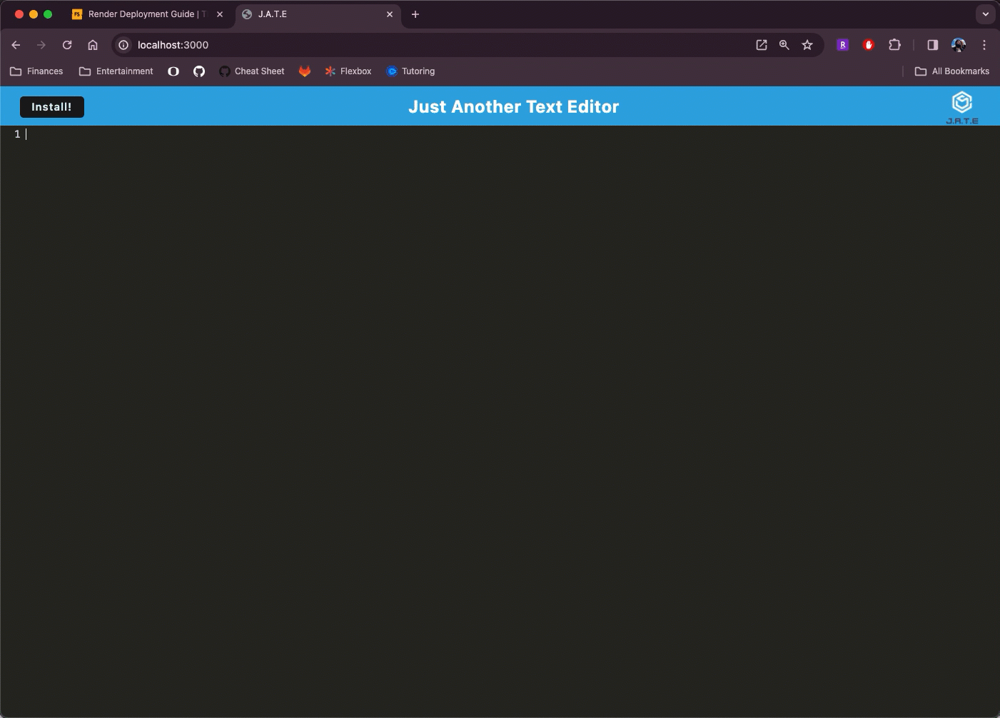

# Progressive Web Applications (PWA) Challenge: Text Editor

## Description

A text editor that runs in the browser. This is a single-page applicationt hat meets the PWA criteria. This project stems from an existing project found here.

## Table of Contents

- [Installation](#installation)
- [Credits](#credits)
- [Example](#example)
- [Features](#features)

## Installation

No installation needed. [Go here](https://expert-doodle.onrender.com//)

## Credits

[Original repo](https://github.com/coding-boot-camp/cautious-meme)

## Example

## Features

PWAs, npm, IndexDB API, Heroku, webpack plugins

## GitHub Profile

https://github.com/viaheather
